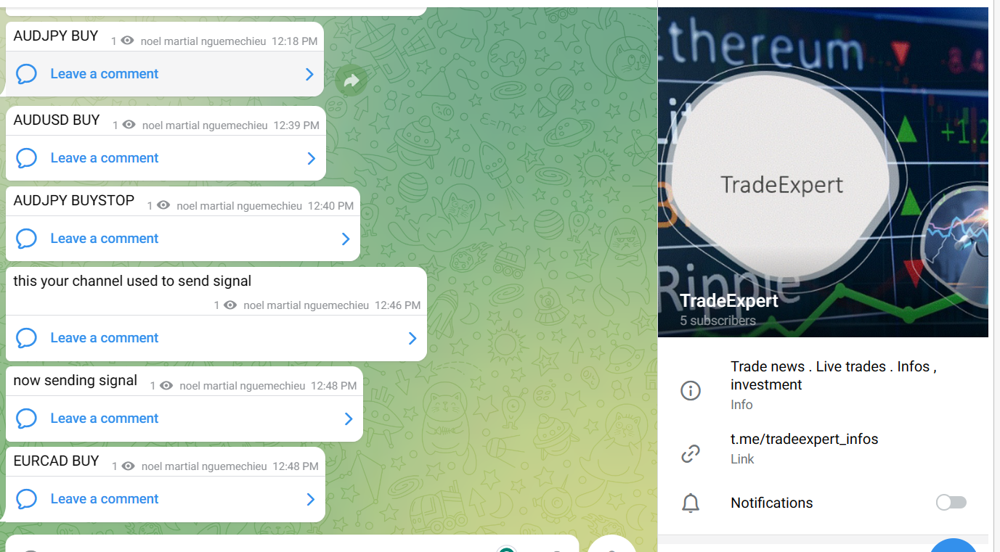

# TelegramSignalTrader

**TelegramSignalTrader** is a sophisticated investment utility software designed for MT4 and MT5 platforms. It empowers users to execute live trades directly from Telegram, leverage manual trading capabilities, and efficiently manage their investment portfolios. This tool is particularly valuable for individuals seeking to capitalize on market fluctuations without the need to constantly monitor screens.


## Key Features

- Live Trade Execution
- Manual Trade Options
- Signal Provider Integration
- Account Management Tools

## Description

TelegramSignalTrader is a professional-grade solution that seamlessly integrates with Telegram, enabling users to receive trade signals, execute trades, and manage their accounts with ease. Whether you prefer automated signal execution or manual trading, this platform provides the flexibility and functionality you need to stay ahead in the market.

## Installation Process

1. **Copy Files**: Copy all folders from the "include" directory into your platform's include directory. Similarly, copy all files from the "expert" directory into your expert directory.
2. **Load TelegramSignalTrader**: Load the TelegramSignalTrader application onto your trading chart.
3. **Configure Parameters**: Set your API key and chat ID or channel name within the application.
4. **Launch Application**: Launch TelegramSignalTrader and wait for confirmation of successful parameter setup.
5. **Verification**: Check for your channel or bot name confirmation to ensure successful installation.
6. **Start Trading**: Once installed, you are ready to start trading and managing your portfolio through TelegramSignalTrader.

## Demo

[](https://youtu.be/k0Ly_gyRb5U)

## Architecture Overview


## Using Docker Container for TelegramSignalTrader

### Installation Commands:

```bash
docker pull TelegramSignalTrader
docker run --name TelegramSignalTrader
```




---

Feel free to reach out to **TradeAdviser LLC** for any support or inquiries at +1 (302) 317-6610 or via email at nguemechieu@live.com. Please note that the software is distributed under the Apache 2 license, and standard trading risk disclaimers apply. Happy Trading!
