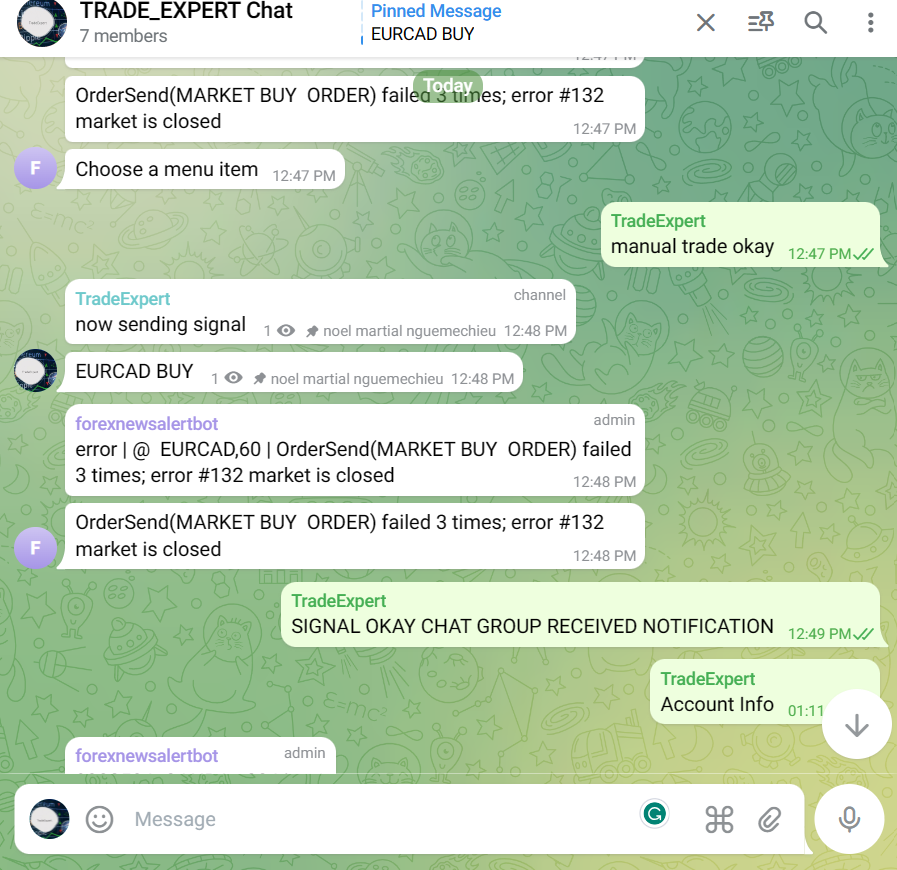

TelegramSignalTrader 

## Description

This is the `TelegramSignalTrader` Expert Advisor (EA) script developed by nguemechieu noel . It is a very interactive smartBot designed to use multiple indicators based on defined strategies to generate trade signals and open orders. The EA integrates a news filter to allow trading based on news events and can generate signals with screenshots on Telegram or other platforms without using DLL imports. This capability enables the EA to trade on your VPS without restrictions. The Bot can trade, generate, manage, and send trading signals to a Telegram channel.

## Version

-   Expert Advisor Name: TelegramSignalTrader
- **Version:** 2.01

## Requirements
 
- **Tester File:** trade.csv
- **Tester Library:** Libraries
- **Stack Size:** 1000000

## Installation

1. Copy the `TelegramSignalTrader.mq4` file to your MetaTrader 4 (MT4) platform's Experts folder.
2. Compile the script in MetaEditor.
3. Attach the EA to your desired chart in MT4.

4. 

## Features

- Interactive smartBot with multiple indicators.
- News filter integration.
- Generates trade signals with screenshots.
- Sends signals to Telegram or other platforms.
- Can trade, manage orders, and send signals to a Telegram channel.
- Easy-to-use and configurable settings.

## Usage

1. Load the EA onto your MT4 chart.
2. Configure the settings such as language, token, username filter, templates, and update mode.
3. Run the EA and monitor its performance.
## 
## Configuration

- **Language:** Select the language for the Bot (English or another language).
- **Token:** Set the Telegram API token for the Bot.
- **Username Filter:** Filter messages based on Telegram usernames.
- **Templates:** Configure message templates for the Bot.
- **Update Mode:** Set the update frequency for the Bot (fast, normal, slow).

 -  Copyright 2023, tradeadviser.org.
 - [TradeAdviser](https://www.tradeadviser.org)
 - GitHub
     [TelegramSignalTrader Repository](https://github.com/nguemechieu/TelegramSignalTrader)
### License

This script is distributed under the Apache 2 License. See the [LICENSE](LICENSE) file for details.

## Support

For support or inquiries, please contact noel nguemechieu. at ?[!nguemechieu@live.com](mailto:nguemechieu@live.com) or call +1 (302) 317-6610.
