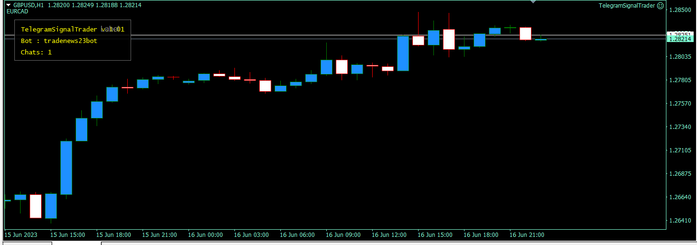
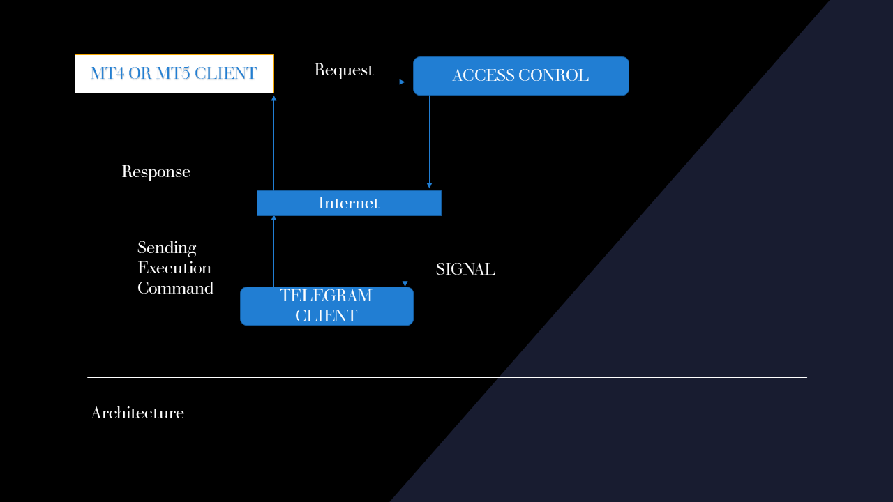

# TelegramSignalTrader

 Live Trade, Manual Trade, Management, and  trade signals  execution from the signal provider

## Description 
System for MT4 and MT5   platforms.
TelegramSignalTrader is a professional investment utility software that allowed you to execute live trades directly from Telegram using your 
own signal provider, trade manually from Telegram, and manage your portfolio.
This is a great tool for anyone who may want to take advantage of market fluctuation while investing his time in something else instead of remaining in front of the screen all day.

## Features

- Screenshots
- Multiple
- trade signals
- Live Trade
- Manual Trade
- Signals trader
- Account Management

## Installation
 - Copy all  folders  that are inside include directory into your include directory
 - Copy all files that are inside the expert directory into your expert directory
 - load TelegramSignalTrader into your chart
 - Set your parameters (api key and chat-id or channel name)
 - Launch the Application
 - Wait for the Application to display a message about your parameters
 - If you see your channel or bot name , you have successfully installed telegramSignalTrader.
- Welcome and Happy trading
# Demo

# Architecture

### VPS :
USE docker container to run TelegramSignalTrader
       

### Commands: 
             docker pull TelegramSignalTrader
             
             docker run - name TelegramSignalTrader
